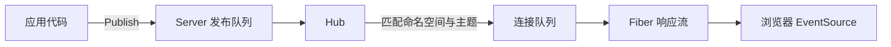

`sseserver-fiber` 是一个面向 Fiber v3 的轻量进程内 [Server-Sent Events](https://html.spec.whatwg.org/multipage/server-sent-events.html) 代理。它负责保持 HTTP 事件流，并把应用消息路由到已连接的客户端。

当 Fiber 应用需要从服务端单向推送任务进度、状态变化、通知或实时看板数据时，可以使用它。

## 提供的能力 {#provides}

- 按命名空间，或按“命名空间＋主题”订阅的 Fiber 处理器。
- 发布原始字节、JSON 或完整消息的 API。
- 命名空间精确匹配与可选的主题定向投递。
- 可配置的发布队列与单连接队列。
- 定期发送 SSE 保活注释。
- 通过 `Server.Close` 显式且幂等地关闭服务。

## 消息流 {#message-flow}

`New` 会启动一个 Hub goroutine。订阅请求先向 Hub 注册连接，随后 Fiber 持续把队列中的内容写入客户端。发布调用负责把消息放入队列；Hub 只格式化一次，再把它交给所有匹配的连接。

## 投递模型 {#delivery-model}

消息采用实时、尽力而为的投递方式，不会持久化以供后续重放。客户端只会收到连接存活期间发布的消息；如果某个客户端的连接队列被填满，该连接会被断开，避免它拖慢其他订阅者。

> [!IMPORTANT]
> 这个库不是持久化消息代理。它不会保存事件、协调多个应用进程，也不会重放遗漏消息。需要这些保证时，应引入外部消息代理或事件存储。

身份认证和权限校验由 Fiber 应用负责。注册 SSE 处理器前，请把相应中间件应用到路由上。

## 下一步 {#next-step}

跟随[快速开始](../../get-started/quickstart/)，运行一个完整的发布端与浏览器订阅端。
